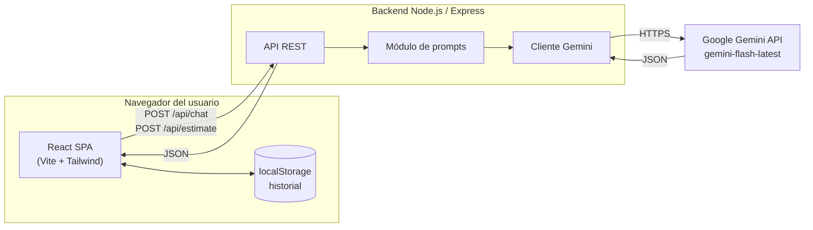
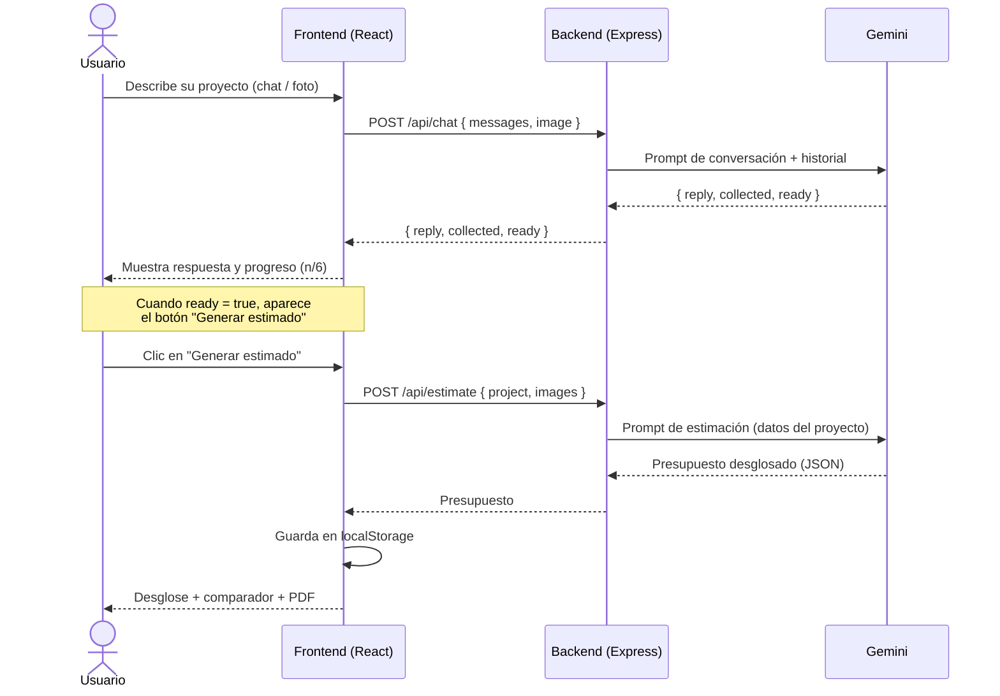
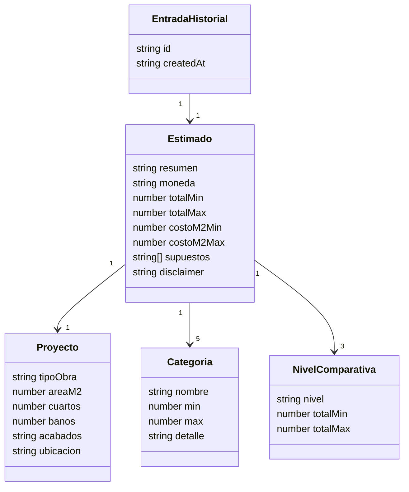

# Documentación técnica — Construct-IA

Este documento complementa el [README](../README.md) con los diagramas y la
descripción técnica de la organización del sistema.

---

## 1. Arquitectura general

Construct-IA usa una arquitectura **cliente–servidor de dos capas** con la IA
como servicio externo. El backend es un *proxy seguro*: encapsula la clave de
Gemini y la lógica de prompts, exponiendo una API REST simple al frontend.

---

## 2. Flujo de una estimación

---

## 3. Capas y responsabilidades

### Capa de presentación (frontend)
- **`App.jsx`** — orquesta el estado (mensajes, datos recopilados, estimado,
  historial) y coordina las llamadas a la API.
- **`components/`** — UI modular: `Header`, `ChatPanel`, `ChatInput`,
  `MessageBubble`, `EstimatePanel`, `CostBreakdown`, `Comparator`,
  `HistoryDrawer`, `EmptyState`.
- **`lib/`** — utilidades: `api.js` (Axios), `pdf.js` (jsPDF), `storage.js`
  (localStorage) y `format.js` (moneda/fechas).

### Capa de lógica de negocio (backend)
- **`routes/chat.js`** — endpoint conversacional; traduce el historial al
  formato de Gemini y adjunta imágenes.
- **`routes/estimate.js`** — valida los datos del proyecto y solicita el
  presupuesto estructurado.
- **`prompts.js`** — instrucciones de sistema (ingeniería de prompts) del
  dominio de construcción panameño.
- **`gemini.js`** — envoltura del SDK: fuerza salida JSON y la parsea de forma
  robusta.

### Servicios externos
- **Google Gemini** (`gemini-flash-latest`) — procesamiento de lenguaje natural,
  análisis de imágenes y generación del estimado.

---

## 4. Modelo de datos (en memoria / localStorage)

No hay base de datos relacional. Las entidades relevantes se representan como
objetos JSON:

---

## 5. Decisiones de diseño

| Decisión | Justificación |
|---|---|
| **Gemini en lugar de Claude/OpenAI** | Nivel gratuito suficiente para la demo académica. |
| **Backend como proxy** | Mantiene la clave de API fuera del navegador (buena práctica de seguridad). |
| **localStorage en vez de PostgreSQL** | Simplifica la demo sin sacrificar la funcionalidad de historial. |
| **Salida JSON forzada del modelo** | Permite un frontend determinista (desglose, comparador, PDF) a partir de la IA. |
| **Estilo Swiss / minimalista** | Transmite confianza y profesionalismo, adecuado para un estimador de costos. |
